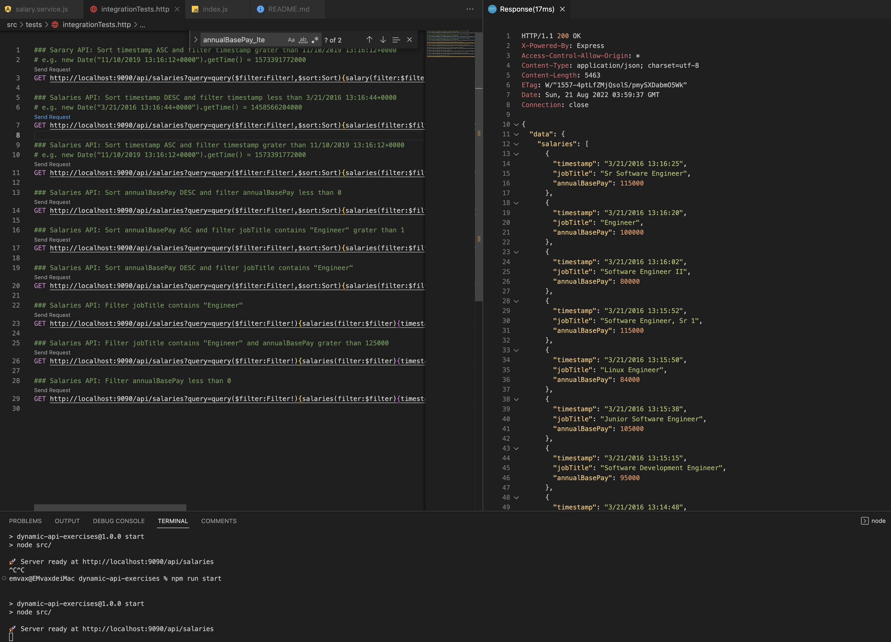
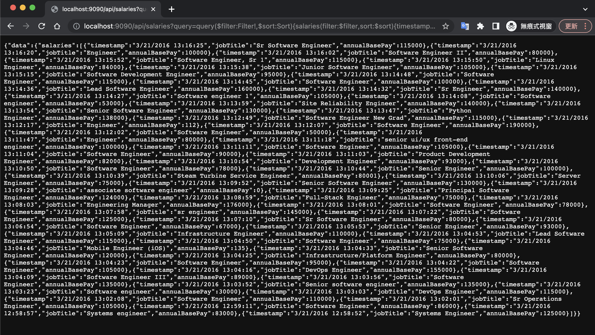

# dynamic-api-exercises

## Abstract
> A dynamic API service supports custom response fields, filter, and sorting and is written in GraphQL and NodeJS.
> Due to the short schedule, I choose to implement it on the application directly without DataBase(another dependency) to quickly finish the PoC.

## Installation
- Ensure you have install NodeJS.
  - https://nodejs.org/en/download/
```bash
npm install
```

## Getting Started
- To start API service.
```bash
npm start
```

## API Testing Example
- You can refer to this http file [integrationTests.http](./src/tests/integrationTests.http) to do API Testing.
- Below API including custom fields, filter, sort
- **API Path:** http://localhost:9090/api/salaries
- **API Query:** 
```js
?query=query($filter:Filter!,$sort:Sort){
    salaries(filter:$filter,sort:$sort)
    {timestamp,jobTitle,annualBasePay}
  }
  &variables={
    "filter":{"jobTitle":"Engineer","timestamp_lte":"1458566204000"},
    "sort":{"timestamp":"DESC"}
    }
```
- Custom fields
  - salaries(filter:$filter,sort:$sort)**{timestamp,jobTitle,annualBasePay}**
- Filter
  - &variables={**"filter":{"jobTitle":"Engineer","timestamp_lte":"1458566204000"}**}
  - timestamp_lte
    - Need to use the new Date().getTime() in javascript.
- Sort
  - &variables={"filter":{"jobTitle":"Engineer","timestamp_lte":"1458566204000"},**"sort":{"timestamp":"DESC"**}}

## Preview
- Run server and send GET Request via HTTP Client Extension.

- Use GET API with Chrome.
